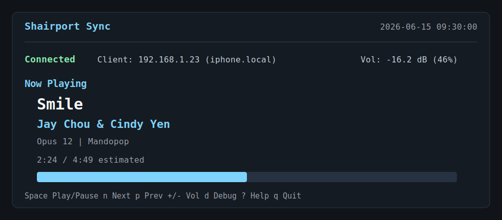

# shairport-sync-tui

Terminal dashboard and control surface for
[Shairport Sync](https://github.com/mikebrady/shairport-sync).

`shairport-sync-tui` shows the active AirPlay client, playback metadata,
estimated song progress, service health, audio output state, recent logs, and
connection history. It can also send basic playback controls over Shairport
Sync's D-Bus remote-control interface.



## Features

- Live Shairport Sync status from the system D-Bus.
- Now-playing metadata: title, artist, album, genre, volume, and progress.
- Local progress estimation for Shairport Sync builds where `ProgressString`
  does not update continuously.
- Playback controls: play/pause, next, previous, stop, mute, and volume.
- Clean main playback screen with status, client, now-playing metadata,
  progress, volume, and controls.
- Debug screen, opened with `d`, for service health, audio output, connection
  history, and recent logs.
- Service health for `shairport-sync.service` and `avahi-daemon.service`.
- Audio output details for configured backend, ALSA device, mixer, Pulse sink,
  ALSA volume, and detected playback devices.
- Recent `journalctl` logs in the debug screen.
- Persistent connection history in `~/.cache/shairport-tui/history.json`.
- Scrollable debug view for longer logs and history.
- In-app help overlay with `?`.
- Debug filters for services, audio, history, and logs.
- Client hostname lookup when the OS can resolve the AirPlay source address.
- Artwork path hints in debug when Shairport Sync exposes cover art.
- Config file support at `~/.config/shairport-tui/config.json`.
- `--doctor` diagnostics for dependencies, services, D-Bus, logs, and audio.
- `--clear-history` for deleting saved connection history.
- `--no-color` for plain terminal output.
- Bash and zsh completions, a man page, CI, and Debian packaging metadata.

## Requirements

- Linux with `systemd`.
- Python 3.
- `python3-dbus`.
- Shairport Sync built with D-Bus and metadata support.
- Useful optional commands for richer panels:
  - `systemctl`
  - `journalctl`
  - `pactl`
  - `amixer`
  - `aplay`

On Debian or Ubuntu-style systems:

```bash
sudo apt install python3-dbus
```

Shairport Sync should report build features similar to:

```bash
shairport-sync -V
```

Look for `metadata`, `dbus`, and ideally `mpris` in the output.

## Install

Clone the repo and install the executable somewhere on your `PATH`:

```bash
git clone https://github.com/blue-1ms/shairport-sync-tui.git
cd shairport-sync-tui
install -Dm755 shairport-tui ~/.local/bin/shairport-tui
```

Or use `make`, which also installs the man page and shell completions:

```bash
make install
```

You can also run it directly from the checkout:

```bash
./shairport-tui
```

## Usage

Start the full dashboard:

```bash
shairport-tui
```

Change the auto-refresh interval:

```bash
shairport-tui --interval 0.5
```

Run diagnostics:

```bash
shairport-tui --doctor
```

Clear saved connection history:

```bash
shairport-tui --clear-history
```

Disable color output:

```bash
shairport-tui --no-color
```

Write a default config:

```bash
shairport-tui --write-config
```

Use an alternate config:

```bash
shairport-tui --config ./config.json
```

## Controls

| Key | Action |
| --- | --- |
| `Space` | Play or pause |
| `n` | Next track |
| `p` | Previous track |
| `s` | Stop |
| `+` or `=` | Volume up |
| `-` or `_` | Volume down |
| `m` | Toggle mute |
| `r` | Refresh now |
| `d` | Toggle debug view |
| `0` | Show all debug sections |
| `1` | Show now-playing details only |
| `2` | Show service health only |
| `3` | Show audio output only |
| `4` | Show connection history only |
| `5` | Show recent logs only |
| `?` or `h` | Toggle help |
| `j` / `k` or arrows | Scroll debug view |
| `f` / `b` or Page Down / Page Up | Page debug view |
| `g` / `G` or Home / End | Jump debug view to top / bottom |
| `C` | Clear connection history after confirmation |
| `q` or `Esc` | Quit |

## Views

The main screen is intentionally focused on playback: connection state,
current client, track metadata, volume, progress, and the most useful controls.

Press `d` to open the debug screen. Debug contains the noisier operational
details: systemd health, audio output configuration, ALSA/Pulse state,
connection history, and recent Shairport Sync logs.

Use `0` through `5` in debug to filter the debug sections.

## Configuration

Generate a default config:

```bash
shairport-tui --write-config
```

Default location:

```text
~/.config/shairport-tui/config.json
```

Example:

```json
{
  "color": true,
  "default_view": "main",
  "history_limit": 12,
  "log_lines": 80,
  "refresh_interval": 1.0
}
```

CLI flags override the config where both apply.

## Extra Files

- `docs/shairport-tui.1`: man page.
- `docs/raspberry-pi.md`: Raspberry Pi setup notes.
- `docs/demo.svg` and `docs/demo.txt`: visual and text demos of the main screen.
- `completions/`: bash and zsh completions.
- `packaging/debian/`: lightweight Debian packaging metadata.
- `.github/workflows/ci.yml`: syntax and CLI checks.

## Notes

Shairport Sync can leave the last client IP and last track metadata visible
after playback stops. The TUI labels this as `Last client` when the session is
idle.

Some Shairport Sync builds expose a `ProgressString` value that does not
advance while polling. When playback is `Playing`, this TUI advances progress
locally and marks it as estimated. It resyncs when Shairport Sync reports a new
track or changed progress.

## License

MIT
